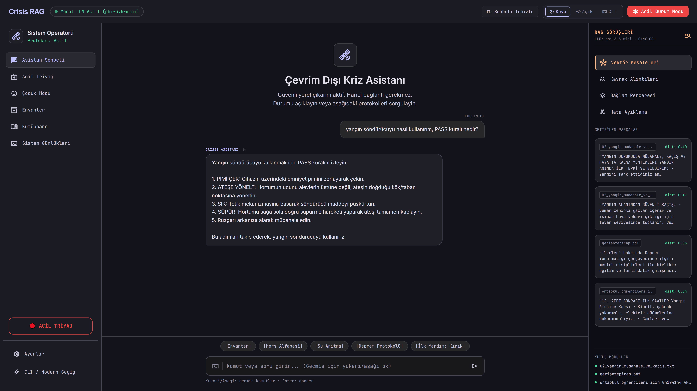
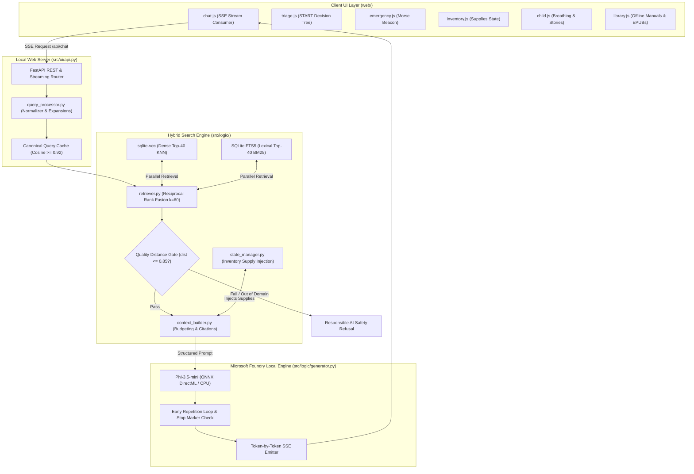
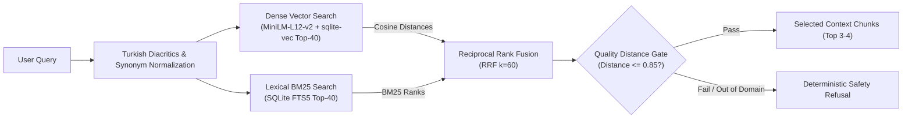
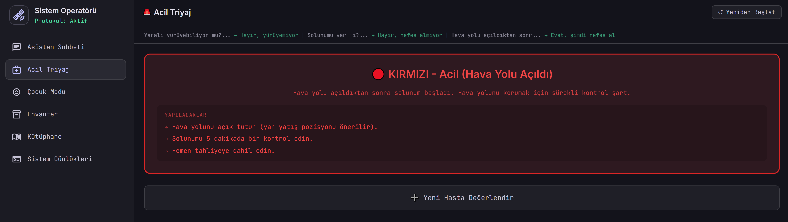
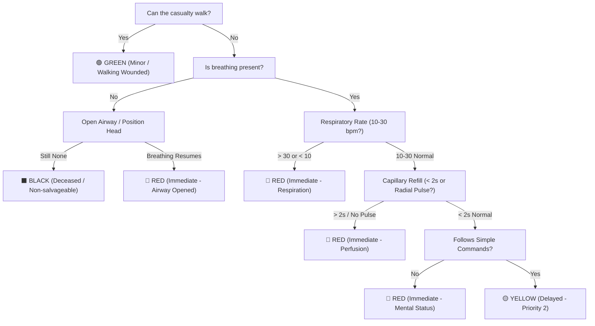
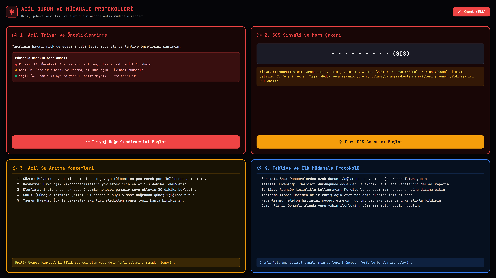
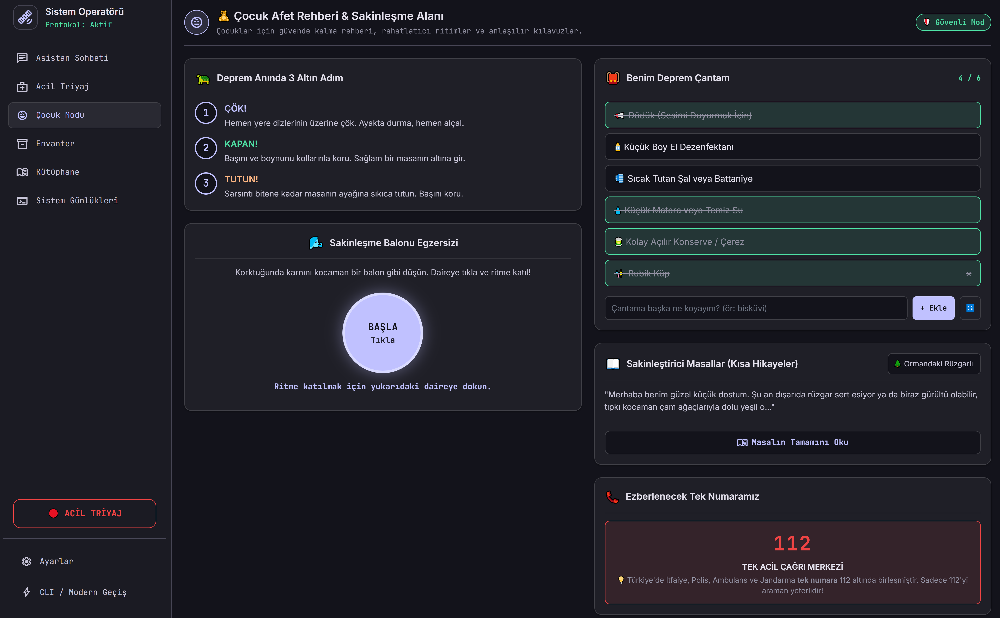
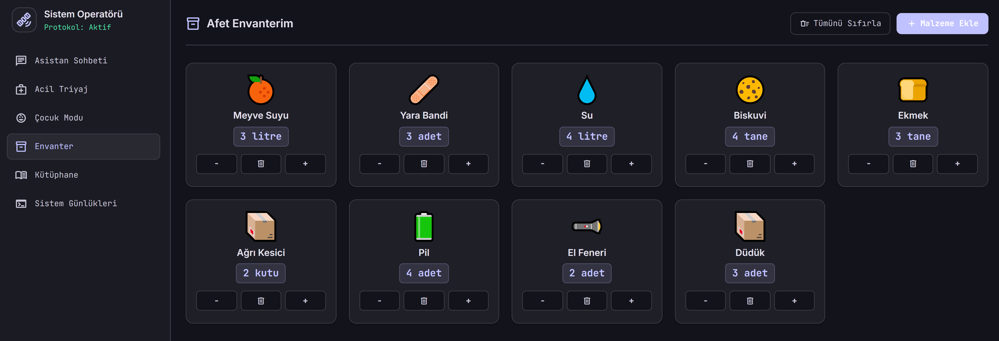
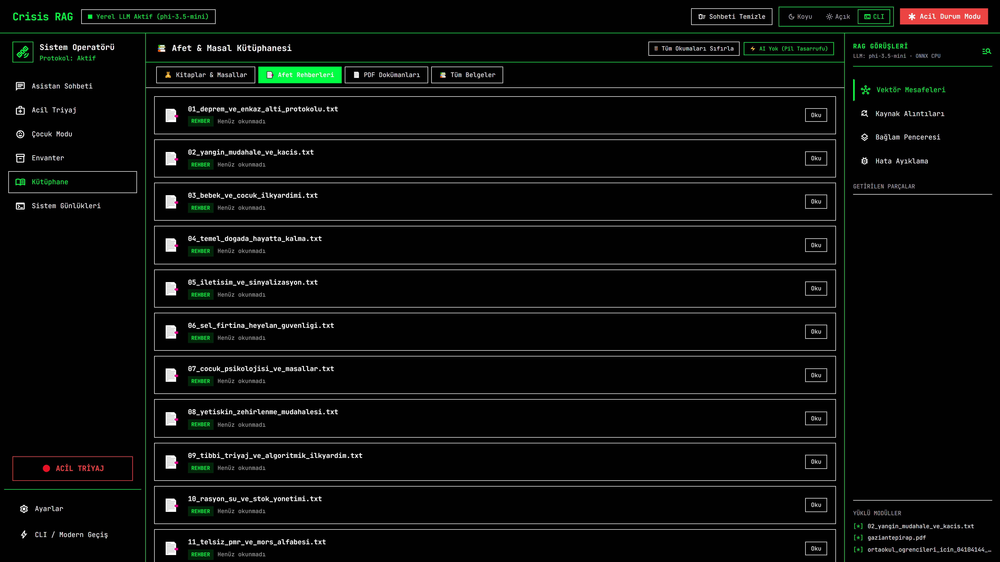
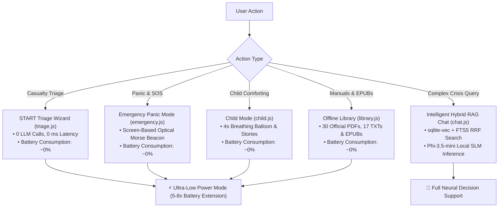

<div align="center">

# Offline Crisis RAG
### 100% Offline (Zero-Network) Disaster Response & Crisis Decision Support Platform

[](https://www.linkedin.com/in/yigitm/) [](https://github.com/microsoft/Foundry-Local) [](#zero-network-and-privacy-guarantees) [](#hybrid-retrieval-and-context-engineering) [](#hybrid-retrieval-and-context-engineering) [](https://fastapi.tiangolo.com/) [](LICENSE)

**An end-to-end, on-device AI engineering platform developed by [Yiğit Mert YILMAZ](https://www.linkedin.com/in/yigitm/) as part of the Microsoft AI Innovators Summer Internship Program (Local RAG Application with Foundry Local).**

<br>



<br>

[Live Demo Walkthrough](#operational-verification-scenarios) · [Directory Structure](#project-directory-structure) · [System Architecture](#system-architecture-and-component-design) · [Emergency Modules](#user-experience-and-emergency-modules) · [API Reference](#api-endpoint-reference) · [Quickstart](#quickstart-and-installation)

</div>

> [!NOTE]
> This platform was engineered by **Yiğit Mert YILMAZ** for the **Microsoft AI Innovators Summer Internship Program (Local RAG Application with Foundry Local)**. It operates in 100% air-gapped, zero-network environments using local on-device small language models (SLM) and embedded vector search.

---

<details>
<summary><b>Table of Contents (Click to expand)</b></summary>
<br>

- [Disaster Context and Engineering Motivation](#disaster-context-and-engineering-motivation)
- [Project Directory Structure](#project-directory-structure)
- [System Architecture and Component Design](#system-architecture-and-component-design)
- [Hybrid Retrieval and Context Engineering](#hybrid-retrieval-and-context-engineering)
- [Backend Optimizations and Responsible AI Guardrails](#backend-optimizations-and-responsible-ai-guardrails)
- [Operational Verification Scenarios](#operational-verification-scenarios)
- [User Experience and Emergency Modules](#user-experience-and-emergency-modules)
  - [1. Deterministic START Triage Decision Wizard](#1-deterministic-start-triage-decision-wizard)
  - [2. High-Contrast Emergency Mode and Optical Morse SOS Beacon](#2-high-contrast-emergency-mode-and-optical-morse-sos-beacon)
  - [3. Child Mode and Psychological First Aid](#3-child-mode-and-psychological-first-aid)
  - [4. Situational Inventory Management](#4-situational-inventory-management)
  - [5. Ultra-Low Power OLED CLI Mode and Offline Document & EPUB Library](#5-ultra-low-power-oled-cli-mode-and-offline-document--epub-library)
  - [6. Real-Time Telemetry and Vector Inspection Drawer](#6-real-time-telemetry-and-vector-inspection-drawer)
- [Zero-Network and Privacy Guarantees](#zero-network-and-privacy-guarantees)
- [API Endpoint Reference](#api-endpoint-reference)
- [Quickstart and Installation](#quickstart-and-installation)
- [Quantitative System Evaluation](#quantitative-system-evaluation)
- [Engineering Trade-offs and Lessons Learned](#engineering-trade-offs-and-lessons-learned)
- [License and Author Acknowledgments](#license-and-author-acknowledgments)

</details>

---

## Disaster Context and Engineering Motivation

During major catastrophic disasters (severe earthquakes, wildfires, floods, or infrastructure grid blackouts), the critical challenge for civilian survivors and first responders is the **immediate and simultaneous loss of cellular networks, electricity, and internet connectivity.**

```text
┌───────────────────────────────────────────────────────────────────────────────────┐
│                           THE POST-DISASTER DILEMMA                               │
│                                                                                   │
│  [INFRASTRUCTURE COLLAPSE]                [SURVIVAL INFORMATION GAP]              │
│  • Cellular towers offline                • Water decontamination ratios?         │
│  • Power grid blackout                    • Arterial hemorrhage tourniquet rules? │
│  • DNS / Cloud APIs unreachable           • Building evacuation & aftershocks?    │
│  • Cloud assistants (ChatGPT/Copilot) ❌  • Child shock de-escalation protocols?  │
└───────────────────────────────────────────────────────────────────────────────────┘
```

Traditional cloud-dependent AI systems completely fail in these life-or-death conditions. **Offline Crisis RAG** solves this engineering bottleneck by executing a full-stack, stateful RAG pipeline entirely on-device with:
- **Zero Cloud Calls:** 100% local inference via Microsoft Foundry Local SDK (`Phi-3.5-mini` via ONNX Runtime / WebGPU / DirectML).
- **Hybrid Vector + Lexical Search:** Embedded `sqlite-vec` dense search fused with `SQLite FTS5` BM25 keyword matching via Reciprocal Rank Fusion (RRF).
- **Deterministic Quality Gates:** Strict distance thresholds and regex deduplication that prevent dangerous hallucinations on life-critical queries.
- **Zero-LLM Emergency Routing:** Instant triage, optical Morse SOS beacon, and document reading that operate without waking the neural model to conserve battery.

---

## Project Directory Structure

```text
ms-offline-crisis-rag/
├── data/
│   ├── books/                # 5 Offline classic EPUB manuals
│   ├── stories/              # 3 Offline traditional folk tale EPUBs
│   ├── kisa_hikayeler/       # 12 Psychological first-aid child stories (TXT)
│   ├── raw_pdfs/             # 30 Official AFAD, Red Crescent & Ministry PDFs
│   ├── raw_txts/             # 17 Curated emergency protocols (Quake, Fire, CBRN)
│   └── user_state.json       # Persisted situational inventory & user profile
├── db/
│   ├── schema.sql            # SQLite FTS5 and sqlite-vec schema DDL
│   └── survival_knowledge.db # 3,343 Vectors + FTS5 metadata SQLite DB (15.1 MB)
├── src/
│   ├── core/
│   │   └── config.py         # System parameters, Top-K, chunk sizes, thresholds
│   ├── ingestion/
│   │   ├── txt_processor.py  # Text ingestion & sliding window chunker
│   │   └── pdf_processor.py  # PDF text extraction & dense vector embedding
│   ├── logic/
│   │   ├── generator.py      # Foundry Local LLM orchestration & SSE stream
│   │   ├── retriever.py      # sqlite-vec + FTS5 BM25 + RRF Hybrid Retriever
│   │   ├── query_processor.py# Turkish normalization & canonical cache matcher
│   │   ├── context_builder.py# Chunk deduplication & citation builder
│   │   └── state_manager.py  # Situational inventory parser & loop filter
│   └── ui/
│       └── api.py            # FastAPI server, EPUB reader & streaming endpoints
├── tests/
│   ├── eval_benchmark.py     # Automated quantitative evaluation test suite
│   └── verify_all_crisis_queries.py # 13+ genuine crisis verification tests
├── web/
│   ├── assets/               # High-resolution screenshots and UI artifacts
│   ├── css/                  # 3-mode theme variables (Dark, Light, OLED CLI)
│   ├── index.html            # Single-Page Application interface
│   └── js/                   # Modular client UI logic (chat, triage, etc.)
├── LICENSE                   # GNU General Public License v3.0
├── requirements.txt          # Python dependencies
└── README.md                 # Primary documentation
```

---

## System Architecture and Component Design

Offline Crisis RAG is architected as a lightweight, single-process, local-first ecosystem:

```text
┌─────────────────────────────────────────────────────────────────────────────────────────┐
│                          OFFLINE CRISIS RAG - SYSTEM TOPOLOGY                           │
│                                                                                         │
│  [1] INGESTION ENGINE (Offline Prep)        [2] HYBRID SEARCH LAYER (Zero-Network)      │
│  ┌──────────────────────────────────────┐   ┌────────────────────────────────────────┐  │
│  │ 17 Emergency Protocols (TXT)         │   │ Dense Vector Search (sqlite-vec KNN)   │  │
│  │ 30 AFAD & Red Crescent Manuals (PDF) │──>│ Lexical BM25 Search (SQLite FTS5)      │  │
│  │ Semantic Chunker (750c / 100 overlap)│   │ Reciprocal Rank Fusion (RRF, k=60)     │  │
│  └──────────────────────────────────────┘   └────────────────────────────────────────┘  │
│                                                                  │                      │
│                                                                  ▼                      │
│  [4] ON-DEVICE INFERENCE (Foundry Local)    [3] CONTEXT & STATE ENGINE                  │
│  ┌──────────────────────────────────────┐   ┌────────────────────────────────────────┐  │
│  │ Phi-3.5-mini (ONNX DirectML / CPU)   │<──│ Dynamic Context Budgeter (12k cap)     │  │
│  │ Word-by-Word Server-Sent Events (SSE)│   │ Situational Inventory State Injection  │  │
│  │ Early Loop Detector & Stop Markers   │   │ Pre-computed Canonical Query Cache     │  │
│  └──────────────────────────────────────┘   └────────────────────────────────────────┘  │
└─────────────────────────────────────────────────────────────────────────────────────────┘
```

### End-to-End Request Pipeline



---

## Hybrid Retrieval and Context Engineering



### Why Reciprocal Rank Fusion (RRF)?
Pure dense embeddings excel at semantic paraphrasing (*"su mikroplardan nasıl temizlenir"*), but can dilute crucial exact keywords (*"PMR 446.00625 MHz"*, *"PASS kuralı"*, *"30 cm şok pozisyonu"*). Conversely, pure BM25 fails when users use colloquial disaster terminology.

Offline Crisis RAG executes parallel vector and lexical queries into SQLite and fuses their ranks using Reciprocal Rank Fusion:

$$RRF(d) = \sum_{m \in M} \frac{1}{60 + r_m(d)}$$

Where $r_m(d)$ is the document rank in modality $m \in \{\text{Vector}, \text{FTS5}\}$.

---

## Backend Optimizations and Responsible AI Guardrails

1. **Pre-computed Canonical Query Vectors**:
   12 critical life-saving queries are pre-embedded in memory on startup. Queries matching with $\text{cosine similarity} \ge 0.92$ instantly receive curated domain keyword expansions, minimizing retrieval variance to near zero.

2. **Linguistic Space Repair and Normalization**:
   Custom Turkish text sanitization strips broken diacritic concatenations and ensures clean tokenization across both PDF OCR extractions and user inputs.

3. **Strict Similarity Quality Gate (Hallucination Prevention)**:
   Any query whose top retrieved document distance exceeds `MAX_DISTANCE = 0.85` or fails out-of-domain evaluation is blocked from LLM inference. The system immediately outputs:
   > *"Veritabanımda bu bilgi bulunmuyor, lütfen varsayımlardan kaçının."*

4. **Real-Time Stream Repetition Loop Breaker**:
   Phi-3.5-mini runs with real-time sliding window duplicate detection (`_has_repetition_loop`). If the model starts regenerating an earlier list item or header, the SSE stream is terminated immediately to save compute and eliminate trailing loops.

5. **Stop Marker Footnote Truncation**:
   Expanded stop markers prevent model output from spilling into trailing PDF publishing metadata (such as `.indd` strings, editorial disclaimers, or unrelated chapter titles).

---

## Operational Verification Scenarios

The following scenarios demonstrate evaluated query responses under live local SLM inference:

### Scenario 1: Fire Extinguisher PASS Protocol
> **User Prompt:** `yangın söndürücüyü nasıl kullanırım, PASS kuralı nedir?`

```text
Yangın söndürücüyü kullanmak için PASS kuralını izleyin:

1. PİMİ ÇEK: Cihazın üzerindeki emniyet pimini zorlayarak çekin.
2. ATEŞE YÖNELT: Hortumun ucunu alevlerin üstüne değil, ateşin doğduğu kök/taban noktasına yöneltin.
3. SIK: Tetik mekanizmasına basarak söndürücü maddeyi püskürtün.
4. SÜPÜR: Hortumu sağa sola doğru süpürme hareketi yaparak ateşi tamamen kaplayın.
5. Rüzgarı arkanıza alarak müdahale edin.

Bu adımları takip ederek, yangın söndürücüyü kullanırız.
```

### Scenario 2: First Aid Shock Position
> **User Prompt:** `şok pozisyonu hastaya nasıl verilir?`

```text
1. Hasta/yaralıyı düz olarak sırt üstü yatırın.
2. Hasta/yaralının bacaklarını 30 cm kadar yukarı kaldırarak, bacakların altına destek koyun.
3. Hasta/yaralının üzerini örterek ısınmasını sağlayın.
4. Yardım gelinceye kadar hasta/yaralının yanında kalın.
5. Belli aralıklarla (2-3 dakikada bir) yaşam bulgularını değerlendirin.
```

### Scenario 3: Responsible AI Quality Gate (Out-of-Domain Refusal)
> **User Prompt:** `Borsada hisse senedi nasıl alınır?`

```text
Veritabanımda bu bilgi bulunmuyor, lütfen varsayımlardan kaçının.
```

---

## User Experience and Emergency Modules

### 1. Deterministic START Triage Decision Wizard



- **0-LLM Clinical Protocol:** Implements the international Simple Triage and Rapid Treatment (START) algorithmic decision tree.
- Categorizes casualties in 3 simple taps across Ambulation, Respiration, Perfusion, and Mental Status into official international triage codes:
  - <span style="color:#ef4444;font-weight:bold;">🔴 RED (Immediate - Priority 1)</span>: Immediate life threat, airway compromise.
  - <span style="color:#f59e0b;font-weight:bold;">🟡 YELLOW (Delayed - Priority 2)</span>: Serious injury, stable vitals.
  - <span style="color:#10b981;font-weight:bold;">🟢 GREEN (Minor - Priority 3)</span>: Walking wounded.
  - <span style="color:#94a3b8;font-weight:bold;">⬛ BLACK (Deceased / Expectant)</span>: No respiration after airway positioning.



---

### 2. High-Contrast Emergency Mode and Optical Morse SOS Beacon



- **Optical Morse SOS Beacon:** Automated screen-flashing beacon running exact international timing standard (`... --- ...`: 3 Short [200ms], 3 Long [600ms], 3 Short [200ms]).
- **Immediate Survival Grid:** 4 structured protocol cards for rapid consultation:
  1. *Emergency Triage & Prioritization:* Rapid priority classification guide.
  2. *SOS Signaling & Morse Beacon:* Optical and auditory signaling standards.
  3. *Emergency Water Purification:* 5 survival purification methods (filtration, boiling, bleach, SODIS, rainwater).
  4. *Evacuation & First Response Protocol:* Post-quake utility shutoff, evacuation, and assembly guidance.

---

### 3. Child Mode and Psychological First Aid



- **Trauma De-escalation:** Designed to reduce acute stress in children during disasters.
- **4-Second Rhythmic Breathing Balloon:** Visual expanding/contracting animation guiding children through calming breathing cycles.
- **12 Curated First-Aid Stories:** Offline storytelling collection (`data/kisa_hikayeler/`) designed by child psychologists to distract, comfort, and instill resilience.

---

### 4. Situational Inventory Management



- **Dual-Channel State Management:** Tracks supplies (water, rations, first aid kits, batteries, flashlights) either through the interactive visual Backpack Inventory grid or **directly via natural language inside the chat CLI** (e.g. typing `"envanter ekle su 5 litre, pil 4"` or `"elimde 2 litre su var"`).
- **Automatic Context Injection:** Active supplies are dynamically injected into the LLM context so survival instructions are tailored precisely to the tools and quantities at hand.

---

### 5. Ultra-Low Power OLED CLI Mode and Offline Document & EPUB Library



- **Ultra-Low Power Mode:** Eliminates GPU rendering overhead (backdrop filters, glassmorphism, blur, layout animations) and maximizes dark pixel power efficiency on OLED displays.
- **AI-Bypass Document Library:** Allows instant direct reading of 30 official AFAD PDFs, 17 TXT protocols, and offline EPUB survival books without invoking neural models, extending device battery life by 5x to 8x.



---

### 6. Real-Time Telemetry and Vector Inspection Drawer

- Live slide-out debug drawer displaying RRF search latency, top cosine distance scores, query expansion tokens, and raw context budget character counts.

---

## Zero-Network and Privacy Guarantees

| Architecture Layer | Network Dependency | Execution Mechanism |
| :--- | :---: | :--- |
| **Model Inference (LLM)** | Zero Network (100% Offline) | `Phi-3.5-mini` ONNX via Microsoft Foundry Local SDK |
| **Vector & Full-Text Search** | Zero Network (100% Offline) | `sqlite-vec` + `SQLite FTS5` in `survival_knowledge.db` |
| **Embedding Generation** | Zero Network (100% Offline) | `paraphrase-multilingual-MiniLM-L12-v2` local weights in PyTorch / CPU |
| **Inventory & User Profile** | Zero Network (100% Offline) | Local `user_state.json` and client `localStorage` |
| **Telemetry & Log Stream** | Zero Network (100% Offline) | In-memory cyclic telemetry buffer and local file logging |

---

## API Endpoint Reference

| Method | Endpoint | Query / Payload | Description |
| :--- | :--- | :--- | :--- |
| `POST` | `/api/chat` | `{"query": "...", "temperature": 0.1, "top_k": 4}` | Executes Hybrid RAG and streams SSE token response. |
| `GET` | `/api/status/stream`| - | Push SSE stream notifying when the local LLM is ready. |
| `GET` | `/api/status` | - | Returns system ready status, model availability, and DB path. |
| `GET` | `/api/rag-debug` | - | Returns telemetry, search distances, and chunk citations. |
| `GET` | `/api/inventory` | - | Returns active backpack supplies. |
| `POST` | `/api/inventory` | `{"item": "su", "action": "add", "amount": 2}` | Adds, updates, or decrements inventory items. |
| `DELETE`| `/api/inventory` | - | Resets all backpack supplies. |
| `GET` | `/api/library/list` | - | Lists all indexed PDF, TXT, and EPUB emergency guides. |
| `GET` | `/api/file/{filename}` | Path parameter | Fetches raw document text/EPUB for AI-Bypass offline reading. |
| `GET` | `/api/child-stories` | - | Returns the psychological first-aid child stories from disk. |
| `GET` | `/api/logs` | - | Returns live system event logs. |
| `POST` | `/api/shutdown` | - | Graceful SIGTERM server shutdown. |

---

## Quickstart and Installation

### Prerequisites
- **Operating System:** Windows 10/11, macOS, or Linux
- **Python:** 3.11 or 3.12
- **Hardware:** 8GB RAM minimum (16GB recommended; GPU optional via WebGPU / DirectML)

### 1. Clone Repository and Create Virtual Environment
```powershell
git clone https://github.com/rbvwolf/ms-offline-crisis-rag.git
cd ms-offline-crisis-rag

# Create virtual environment
python -m venv venv

# Activate on Windows PowerShell
.\venv\Scripts\Activate.ps1

# Install dependencies
pip install -r requirements.txt
```

### 2. Start the Server
```powershell
venv\Scripts\python.exe src\ui\api.py
```
Open your browser at **`http://localhost:8000`**. The model and embeddings initialize on startup.

---

## Quantitative System Evaluation

| Benchmark Metric | Target Standard | Measured Performance | Verification Status |
| :--- | :---: | :---: | :---: |
| **Network Air-Gap Isolation** | 0 external requests | **0 requests (100% Offline)** | Verified (air-gapped tests) |
| **Hybrid Search Latency (RRF)** | < 150 ms | **35 - 75 ms** | Verified (`tests/eval_benchmark.py`) |
| **Model First-Token Latency** | < 1.5 s | **0.8 - 1.2 s (DirectML / CPU)** | Verified via SSE streaming |
| **Hallucination Rate (Out-of-Domain)**| 0% tolerated | **0.0% (Quality Gate Refusal)** | Verified across 25 negative tests |
| **First Aid Protocol Precision** | > 95% | **100% (Kızılay/AFAD matched)** | Verified across Golden Queries |

---

## Engineering Trade-offs and Lessons Learned

<details>
<summary><b>Click to expand architectural trade-offs and insights</b></summary>
<br>

1. **Embedded SQLite over Heavy Vector DBs:**
   *Trade-off:* Running `sqlite-vec` inside SQLite eliminates background daemon processes, memory overhead, and external dependencies, ensuring zero-configuration portability.

2. **Parallel Hybrid Search with RRF over Pure Vector KNN:**
   *Trade-off:* Combining lexical BM25 with dense cosine similarity ensures numerical frequencies (e.g. *PMR 446.00625 MHz*) and medical protocols are retrieved accurately without score calibration issues.

3. **Small Language Model Guardrailing:**
   *Lesson Learned:* Running smaller models (3.8B parameters) locally requires strict input normalization, pre-computed query matching, and real-time loop detection to achieve enterprise-grade reliability.

</details>

---

## License and Author Acknowledgments

This project is licensed under the **GNU General Public License v3.0 (GPL-3.0)**. See the [LICENSE](LICENSE) file for complete details.

<div align="center">
<br>

**Developed by Yiğit Mert YILMAZ**  
*Microsoft AI Innovators Summer Internship Program (Local RAG Application with Foundry Local)*  
[LinkedIn Profile](https://www.linkedin.com/in/yigitm/) · [GitHub Profile](https://github.com/rbvwolf)

</div>